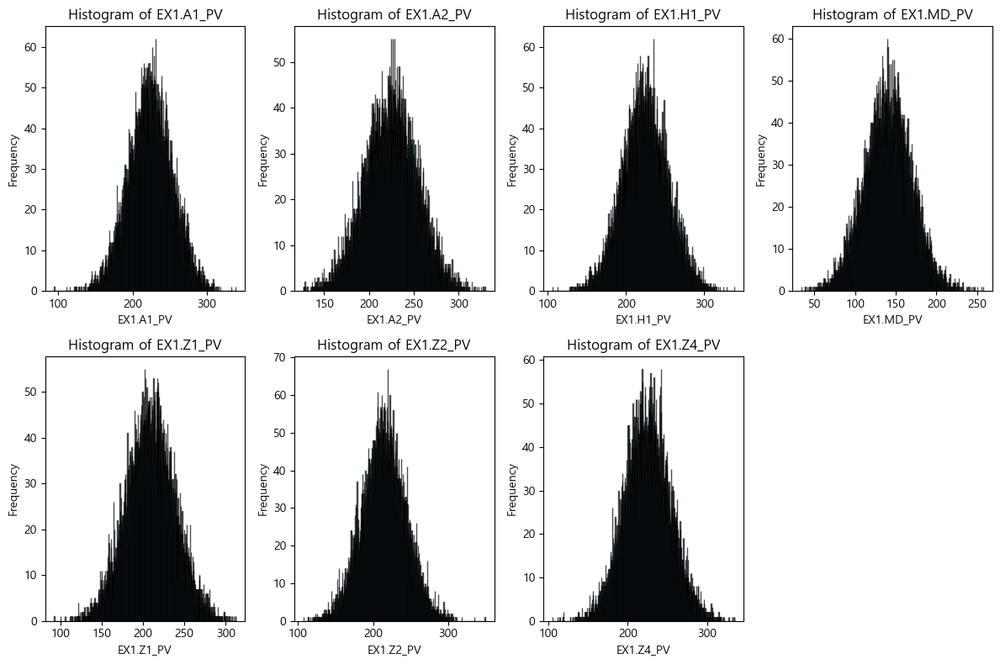
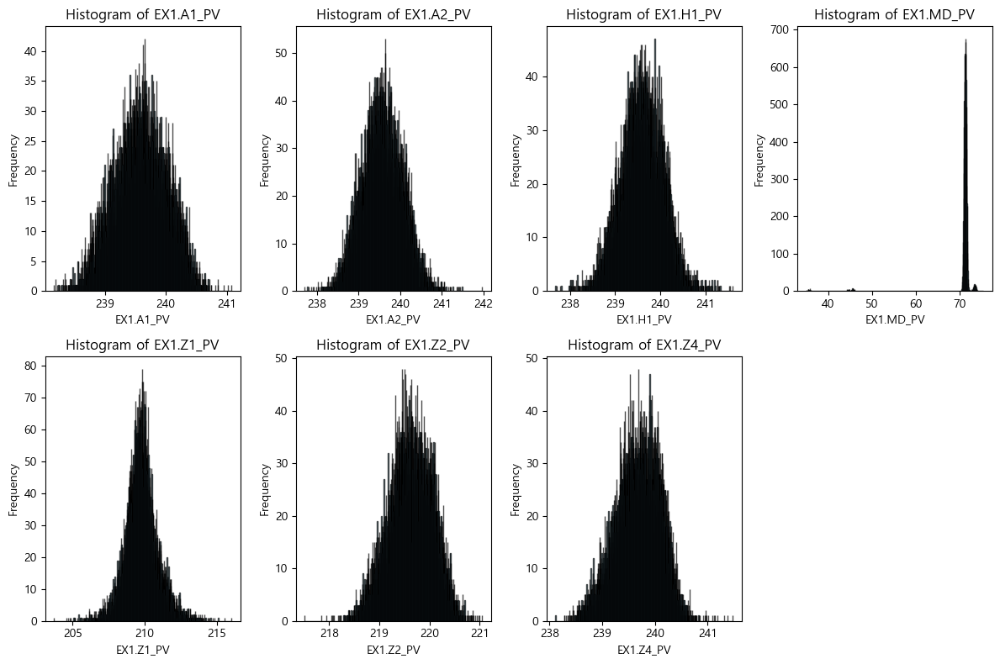

# 🚀 NSGA Multi-objective Optimal

---

## 📚 Table of Contents

- [🚀 NSGA Multi-objective Optimal](#-nsga-multi-objective-optimal)
  - [📚 Table of Contents](#-table-of-contents)
  - [✨ Overview](#-overview)
  - [🎯 Problem Statement](#-problem-statement)
  - [🔍 Exploratory Data Analysis (EDA)](#-exploratory-data-analysis-eda)
    - [상관행렬 및 히트맵](#상관행렬-및-히트맵)
    - [Pair KDE Plot (Before Cleansing)](#pair-kde-plot-before-cleansing)
    - [Pair KDE Plot (After Outlier Removal)](#pair-kde-plot-after-outlier-removal)
  - [🧠 Model Training](#-model-training)
    - [주요 시각화](#주요-시각화)
    - [Feature Importance Table](#feature-importance-table)
  - [🎮 Simulation Setup](#-simulation-setup)
    - [노이즈 적용 프로세스](#노이즈-적용-프로세스)
  - [🔗 References](#-references)

---

## ✨ Overview

이 프로젝트는 **소성가공 공정의 품질 불량 문제**를 해결하기 위한 다중 목적 최적화 프로젝트입니다.  
제공된 데이터셋을 바탕으로 결함 판정 및 주요 변수 확인을 넘어서, 각 변수의 변형 시뮬레이션을 통해 공정 난이도, 제품 품질, 가격을 **동시에 최적화** 하는 것을 목표로 합니다.

---

## 🎯 Problem Statement

- **목표**: 양품과 불량에 영향을 주는 변수 간의 상관관계를 분석하고, AI 모델을 활용하여 불량 판정 및 품질 개선에 기여합니다.
- **추가 과제**: 변수 변형 시뮬레이션을 통해 **공정 난이도, 품질, 가격의 다중 목적 최적화**를 달성합니다.

---

## 🔍 Exploratory Data Analysis (EDA)

  
<strong>1. EDA 상세 분석</strong>

  
### 상관행렬 및 히트맵

- **설명**: 데이터 클렌징 이전에 확인한 상관행렬에서, 우측 하단 feature들 간 높은 상관성을 확인할 수 있습니다.
- **시각화**:  
  

---

### Pair KDE Plot (Before Cleansing)

- **설명**: 우측 하단 feature들의 밀도 플롯을 확인할 수 있습니다.
- **시각화**:  
  

> **참고**: 좌측 상단 feature들은 상관관계가 확인되었지만, 우측 하단 feature들은 이상치로 인한 높은 상관성 가능성이 있습니다.

---

### Pair KDE Plot (After Outlier Removal)

- **설명**: 이상치 제거 후 데이터 분석 결과, `EX1.MD-TQ`는 단일 값을 가지며 분산이 0임이 확인되었습니다.
- **시각화**:  
  

- **결론**: 통제 가능한 변수와 변형 가능한 변수들을 성공적으로 구분하였습니다.
  - **통제할 변수**: `EX1.H4_PV`, `EX1.H2O_PV`, `EX1.MELT_P_PV`
  

---

## 🧠 Model Training

  
<strong>2. 모델 훈련</strong>

모델 훈련에는 **AutoGluon**의 AutoML 모듈을 사용하였습니다.  
모델 평가 지표는 다음과 같습니다.

### 주요 시각화

- **혼동행렬 (Confusion Matrix)**
  

- **ROC Curve**
  

---

### Feature Importance Table

AutoGluon을 통해 각 변수의 중요도와 통계 지표는 아래와 같이 확인할 수 있습니다:

| Feature           | Importance  | Std Dev   | P-Value  | n  | P99 High  | P99 Low   |
|-------------------|-------------|-----------|----------|----|-----------|-----------|
| EX1.MD_PV         | 0.463756    | 0.026445  | 0.000001 | 5  | 0.518207  | 0.409306  |
| EX1.MELT_P_PV     | 0.038641    | 0.028176  | 0.018708 | 5  | 0.096655  | -0.019373 |
| EX1.Z1_PV         | 0.021422    | 0.011535  | 0.007116 | 5  | 0.045173  | -0.002330 |
| EX1.H2O_PV        | 0.017881    | 0.014669  | 0.026337 | 5  | 0.048084  | -0.012322 |
| EX1.A1_PV         | 0.007319    | 0.008252  | 0.059176 | 5  | 0.024309  | -0.009671 |
| EX1.A2_PV         | 0.003299    | 0.004521  | 0.089050 | 5  | 0.012608  | -0.006010 |
| EX1.H1_PV         | 0.002655    | 0.011458  | 0.315860 | 5  | 0.026246  | -0.020936 |
| EX1.H4_PV         | 0.002333    | 0.005217  | 0.186950 | 5  | 0.013076  | -0.008409 |
| EX1.Z2_PV         | 0.001814    | 0.004056  | 0.186950 | 5  | 0.010166  | -0.006538 |
| EX1.Z4_PV         | 0.001502    | 0.003358  | 0.186950 | 5  | 0.008417  | -0.005413 |
| EX1.H3_PV         | 0.000000    | 0.000000  | 0.500000 | 5  | 0.000000  | 0.000000  |
| EX5.MELT_TEMP     | 0.000000    | 0.000000  | 0.500000 | 5  | 0.000000  | 0.000000  |
| EX1.H2_PV         | 0.000000    | 0.000000  | 0.500000 | 5  | 0.000000  | 0.000000  |
| EX4.MELT_TEMP     | 0.000000    | 0.000000  | 0.500000 | 5  | 0.000000  | 0.000000  |
| EX1.Z3_PV         | 0.000000    | 0.000000  | 0.500000 | 5  | 0.000000  | 0.000000  |
| EX2.MELT_TEMP     | 0.000000    | 0.000000  | 0.500000 | 5  | 0.000000  | 0.000000  |
| EX3.MELT_TEMP     | 0.000000    | 0.000000  | 0.500000 | 5  | 0.000000  | 0.000000  |
| EX1.MD_TQ         | 0.000000    | 0.000000  | 0.500000 | 5  | 0.000000  | 0.000000  |

---

## 🎮 Simulation Setup

시뮬레이션 단계에서는 선정된 변수들을 기반으로 전체 시스템 모델링과 최적화 시뮬레이션을 진행합니다.

- **시뮬레이션 제외 변수**:  
  - `EX1.H4_PV`, `EX1.H2O_PV`, `EX1.MELT_P_PV` → 상관관계가 높아 결과 신뢰성에 영향을 줄 수 있습니다.
  - `"EX1.H3_PV"`, `"EX5.MELT_TEMP"`, `"EX1.H2_PV"`, `"EX4.MELT_TEMP"`, `"EX1.Z3_PV"`, `"EX2.MELT_TEMP"`, `"EX3.MELT_TEMP"`, `"EX1.MD_TQ"` → 분산이 0인 상수열
- **목표**: 공정 난이도, 제품 품질 및 가격을 최적화하여 불량률을 최소화하고, 새로운 상/하한을 최대화합니다.

### 노이즈 적용 프로세스

1. Train 데이터의 최소/최대 값을 기준으로 shift 값을 적용하여 새로운 구간을 설정합니다.
2. 해당 구간에서 데이터를 정규화합니다.
3. 정규화한 데이터를 로짓 변환(log(x_norm/(1-x_norm)))하여 분포의 부자연스러움을 줄입니다.
4. KDE 알고리즘을 사용해 샘플링을 진행합니다.
5. 역 로짓 변환을 통해 최종 데이터를 생성하여 노이즈를 추가합니다.

> 이 프로세스를 통해 보다 자연스러운 노이즈가 추가된 데이터를 생성할 수 있습니다.

- **시각화**:  
    
  

  해당 데이터에서는 KDE 노이즈가 더욱 적절하다 생각해 KDE 노이즈를 사용했습니다.

---

## 🔗 References

- **데이터 출처**: [KAMP AI](https://www.kamp-ai.kr/aidataDetail?AI_SEARCH=&page=4&DATASET_SEQ=49&EQUIP_SEL=&GUBUN_SEL=&FILE_TYPE_SEL=&WDATE_SEL=)
- **AutoML Tool**: [AutoGluon](https://auto.gluon.ai/)

---

✨ Contributions and enhancements are welcome!  
Happy optimizing and stay creative!