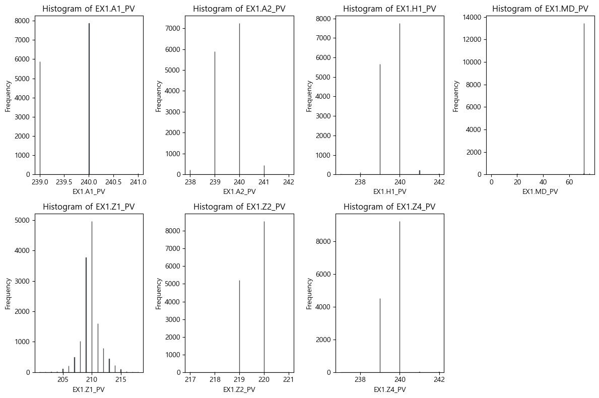
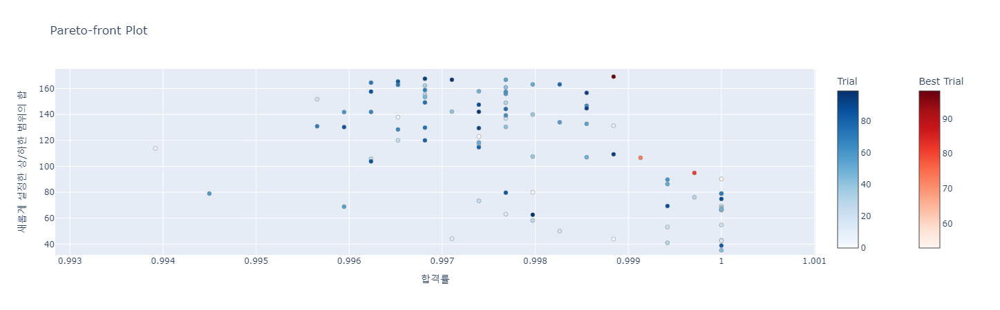

# 🚀 NSGA 다목적 최적화 프로젝트

---

## 📚 목차

- [🚀 NSGA 다목적 최적화 프로젝트](#-nsga-다목적-최적화-프로젝트)
  - [📚 목차](#-목차)
  - [✨ 프로젝트 개요](#-프로젝트-개요)
  - [🎯 문제 정의](#-문제-정의)
  - [🔍 탐색적 데이터 분석 (EDA)](#-탐색적-데이터-분석-eda)
    - [상관행렬 및 히트맵](#상관행렬-및-히트맵)
    - [Pair KDE Plot (Before Cleansing)](#pair-kde-plot-before-cleansing)
    - [Pair KDE Plot (After Outlier Removal)](#pair-kde-plot-after-outlier-removal)
  - [🧠 모델 훈련](#-모델-훈련)
    - [주요 시각화](#주요-시각화)
    - [Feature Importance Table](#feature-importance-table)
  - [🎮 시뮬레이션 설정](#-시뮬레이션-설정)
    - [노이즈 적용 프로세스](#노이즈-적용-프로세스)
      - [기존 데이터 분포](#기존-데이터-분포)
      - [프로세스 단계](#프로세스-단계)
  - [Pareto Front Plot](#pareto-front-plot)
  - [🔗 참고자료](#-참고자료)

---

## ✨ 프로젝트 개요

이 프로젝트는 **소성가공 공정의 품질 불량 문제** 해결을 위한 다목적 최적화 프로젝트입니다.  
제공된 데이터셋을 기반으로 결함 판정, 주요 변수 식별, 및 변수 변형 시뮬레이션을 통해 **공정 난이도, 제품 품질, 가격**을 동시에 최적화하는 것을 목표로 합니다.

---

## 🎯 문제 정의

- **목표**: 양품과 불량에 영향을 주는 변수 간 상관관계 분석 및 AI 모델 활용을 통한 불량 판정과 품질 개선.
- **추가 과제**: 변수 변형 시뮬레이션을 통해 공정 난이도, 품질, 가격의 다중 목적 최적화 달성.

---

## 🔍 탐색적 데이터 분석 (EDA)

  
<strong>1. EDA 상세 분석</strong>

### 상관행렬 및 히트맵

- **설명**: 데이터 클렌징 전 상관행렬을 확인하며, 우측 하단 feature들 간 높은 상관성을 확인할 수 있습니다.
- **시각화**:
  - [헬핏맵 보기](./img/heatmap.png)

---

### Pair KDE Plot (Before Cleansing)

- **설명**: 우측 하단 feature들의 밀도 플롯 확인.
- **시각화**:
  - [Before Cleansing Plot 보기](./img/pair_kde_plot_before_clean.png)

> **참고**: 좌측 상단 feature들은 상관관계가 명확한 반면, 우측 하단 feature들은 이상치 영향이 의심됩니다.

---

### Pair KDE Plot (After Outlier Removal)

- **설명**: 이상치 제거 후 데이터의 변화를 확인합니다. (예: `EX1.MD-TQ`는 단일 값을 가지며 분산이 0임)
- **시각화**:
  - [After Outlier Removal Plot 보기](./img/pair_kde_plot.png)

- **결론**: 통제 가능한 변수와 변형 가능한 변수를 명확히 구분할 수 있었습니다.
  - **통제할 변수**: `EX1.H4_PV`, `EX1.H2O_PV`, `EX1.MELT_P_PV`

---

## 🧠 모델 훈련

  
<strong>2. 모델 훈련 상세</strong>

모델 훈련은 **AutoGluon**의 AutoML 모듈을 사용했습니다.  
모델 평가 지표는 아래와 같습니다.

### 주요 시각화

- **혼동행렬 (Confusion Matrix)**
  - [혼동행렬 보기](./img/confusion_matrix.png)

- **ROC Curve**
  - [ROC Curve 보기](./img/roc_curve.png)

---

### Feature Importance Table

AutoGluon을 통해 각 변수의 중요도 및 통계 지표를 아래 표에서 확인할 수 있습니다:

| Feature           | Importance  | Std Dev   | P-Value  | n  | P99 High  | P99 Low   |
|-------------------|-------------|-----------|----------|----|-----------|-----------|
| EX1.MD_PV         | 0.463756    | 0.026445  | 0.000001 | 5  | 0.518207  | 0.409306  |
| EX1.MELT_P_PV     | 0.038641    | 0.028176  | 0.018708 | 5  | 0.096655  | -0.019373 |
| EX1.Z1_PV         | 0.021422    | 0.011535  | 0.007116 | 5  | 0.045173  | -0.002330 |
| EX1.H2O_PV        | 0.017881    | 0.014669  | 0.026337 | 5  | 0.048084  | -0.012322 |
| EX1.A1_PV         | 0.007319    | 0.008252  | 0.059176 | 5  | 0.024309  | -0.009671 |
| EX1.A2_PV         | 0.003299    | 0.004521  | 0.089050 | 5  | 0.012608  | -0.006010 |
| EX1.H1_PV         | 0.002655    | 0.011458  | 0.315860 | 5  | 0.026246  | -0.020936 |
| EX1.H4_PV         | 0.002333    | 0.005217  | 0.186950 | 5  | 0.013076  | -0.008409 |
| EX1.Z2_PV         | 0.001814    | 0.004056  | 0.186950 | 5  | 0.010166  | -0.006538 |
| EX1.Z4_PV         | 0.001502    | 0.003358  | 0.186950 | 5  | 0.008417  | -0.005413 |
| EX1.H3_PV         | 0.000000    | 0.000000  | 0.500000 | 5  | 0.000000  | 0.000000  |
| EX5.MELT_TEMP     | 0.000000    | 0.000000  | 0.500000 | 5  | 0.000000  | 0.000000  |
| EX1.H2_PV         | 0.000000    | 0.000000  | 0.500000 | 5  | 0.000000  | 0.000000  |
| EX4.MELT_TEMP     | 0.000000    | 0.000000  | 0.500000 | 5  | 0.000000  | 0.000000  |
| EX1.Z3_PV         | 0.000000    | 0.000000  | 0.500000 | 5  | 0.000000  | 0.000000  |
| EX2.MELT_TEMP     | 0.000000    | 0.000000  | 0.500000 | 5  | 0.000000  | 0.000000  |
| EX3.MELT_TEMP     | 0.000000    | 0.000000  | 0.500000 | 5  | 0.000000  | 0.000000  |
| EX1.MD_TQ         | 0.000000    | 0.000000  | 0.500000 | 5  | 0.000000  | 0.000000  |

---

## 🎮 시뮬레이션 설정

시뮬레이션 단계에서는 선정된 변수를 바탕으로 전체 시스템 모델링 및 최적화 시뮬레이션을 수행합니다.

- **시뮬레이션 제외 변수**:  
  - `EX1.H4_PV`, `EX1.H2O_PV`, `EX1.MELT_P_PV`  
    (높은 상관관계로 결과에 영향을 미칠 수 있음)
  - `"EX1.H3_PV"`, `"EX5.MELT_TEMP"`, `"EX1.H2_PV"`, `"EX4.MELT_TEMP"`, `"EX1.Z3_PV"`, `"EX2.MELT_TEMP"`, `"EX3.MELT_TEMP"`, `"EX1.MD_TQ"`  
    (분산이 0인 상수열)

- **목표**:  
  공정 난이도, 제품 품질, 가격 세 측면을 최적화하여 불량률을 최소화하고, 새로운 상/하한을 최대화.

---

### 노이즈 적용 프로세스

#### 기존 데이터 분포

  
<strong>Raw Distribution 보기</strong>

  
  

- 기존 데이터는 특정 분포를 따르지 않으므로, 가우시안 노이즈와 KDE 노이즈를 각각 적용 후 비교.
- **시각화**:
  - [Gaussian Noise](./img/Gaussian_noise.png)
  - [KDE Noise](./img/KDE_noise.png)

> **선택 이유**: 자연스러운 결과를 제공하는 KDE 노이즈를 채택하였습니다.

#### 프로세스 단계

1. **Shift 적용**: Train 데이터의 최소/최대값을 기준으로 새로운 구간 설정.
2. **정규화**: 설정된 구간 내에서 데이터 정규화 수행.
3. **로짓 변환**: 정규화된 데이터에 대해 `log(x_norm/(1-x_norm))` 로짓 변환 수행.
4. **KDE 샘플링**: KDE 알고리즘을 통해 데이터를 샘플링.
5. **역 로짓 변환**: 노이즈가 추가된 최종 데이터 생성.

이를 통해 보다 자연스러운 노이즈가 적용된 데이터를 생성할 수 있습니다.

---

## Pareto Front Plot

---

## 🔗 참고자료

- **데이터 출처**: [KAMP AI](https://www.kamp-ai.kr/aidataDetail?AI_SEARCH=&page=4&DATASET_SEQ=49&EQUIP_SEL=&GUBUN_SEL=&FILE_TYPE_SEL=&WDATE_SEL=)
- **AutoML Tool**: [AutoGluon](https://auto.gluon.ai/)

---

✨ Contributions 및 개선 아이디어 환영합니다!  