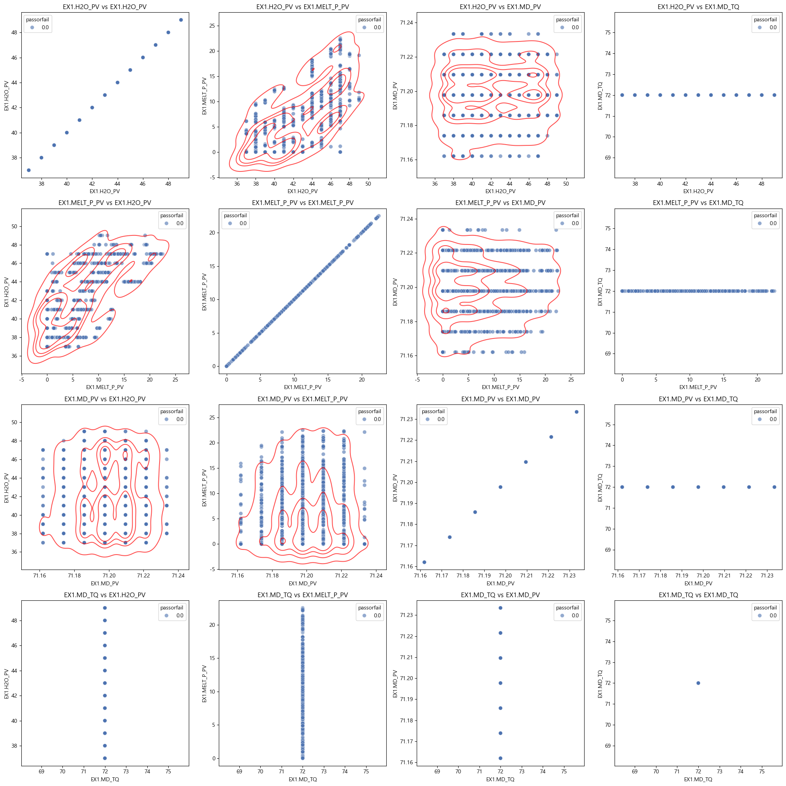

# NSGA Multi-objective Optimal

---

## Table of Contents
- [NSGA Multi-objective Optimal](#nsga-multi-objective-optimal)
  - [Table of Contents](#table-of-contents)
  - [Overview](#overview)
  - [Problem Statement](#problem-statement)
  - [Exploratory Data Analysis (EDA)](#exploratory-data-analysis-eda)
    - [상관행렬 및 히트맵](#상관행렬-및-히트맵)
    - [Pair KDE Plot (Before Cleansing)](#pair-kde-plot-before-cleansing)
    - [Pair KDE Plot (After Outlier Removal)](#pair-kde-plot-after-outlier-removal)
  - [Model Training](#model-training)
    - [주요 시각화](#주요-시각화)
    - [Feature Importance Table](#feature-importance-table)
  - [Simulation Setup](#simulation-setup)
  - [References](#references)

---

## Overview

본 프로젝트는 소성가공 공정의 품질 불량 문제를 해결하기 위한 다중 목적 최적화 프로젝트입니다.  
제공된 데이터셋을 기반으로 결함 판정 및 주요 변수 확인뿐만 아니라, 각 변수의 변형 시뮬레이션을 통해 공정 난이도, 품질, 가격을 동시에 최적화하는 것을 목표로 합니다.

---

## Problem Statement

- **목표**: 양품과 불량에 영향을 주는 변수 간의 상관관계를 파악하고, AI 모델을 활용하여 불량 판정 및 품질 개선에 기여.
- **추가 과제**: 변수 변형 시뮬레이션을 통해 공정 난이도, 품질, 가격의 다중 목적 최적화 진행

---

## Exploratory Data Analysis (EDA)

<strong>1. EDA</strong>

### 상관행렬 및 히트맵

- **설명**: 데이터 클렌징 이전 상관행렬을 살펴보면, 우 하단 feature들 간에 높은 상관성이 관찰됩니다.
- **시각화**:  
  

---

### Pair KDE Plot (Before Cleansing)
- **설명**: 우 하단 feature들의 밀도 plot 확인.
- **시각화**:
  
  

> **참고**: 좌 상단 feature들은 시각화에 한하여 상관관계가 있는 것으로 확인되었으나, 우 하단 feature들은 이상치로 인한 높은 상관관계일 가능성이 있습니다.

---

### Pair KDE Plot (After Outlier Removal)
- **설명**: 이상치 제거 후 데이터에서 EX1.MD-TQ는 단일 값만을 가지며 분산이 0이 됨.
- **시각화**:
  
  

- **결론**: 통제할 변수와 변형 가능한 변수들을 성공적으로 식별하였습니다.
  - **통제할 변수**: `EX1.H4_PV`, `EX1.H2O_PV`, `EX1.MELT_P_PV`
  

---

## Model Training

<strong>2. 모델 훈련</strong>

모델 훈련을 위해 **AutoGluon**의 강력한 AutoML 모듈을 사용했습니다.  
모델 학습 결과는 다음과 같은 지표들을 통해 평가됩니다.

### 주요 시각화

- **혼동행렬 (Confusion Matrix)**
  
  

- **ROC Curve**
  
  

---

### Feature Importance Table

아래는 AutoGluon을 통한 각 변수의 중요도 및 기타 통계 지표를 나타낸 표입니다.

| Feature           | Importance  | Std Dev   | P-Value  | n  | P99 High  | P99 Low   |
|-------------------|-------------|-----------|----------|----|-----------|-----------|
| EX1.MD_PV         | 0.463756    | 0.026445  | 0.000001 | 5  | 0.518207  | 0.409306  |
| EX1.MELT_P_PV     | 0.038641    | 0.028176  | 0.018708 | 5  | 0.096655  | -0.019373 |
| EX1.Z1_PV         | 0.021422    | 0.011535  | 0.007116 | 5  | 0.045173  | -0.002330 |
| EX1.H2O_PV        | 0.017881    | 0.014669  | 0.026337 | 5  | 0.048084  | -0.012322 |
| EX1.A1_PV         | 0.007319    | 0.008252  | 0.059176 | 5  | 0.024309  | -0.009671 |
| EX1.A2_PV         | 0.003299    | 0.004521  | 0.089050 | 5  | 0.012608  | -0.006010 |
| EX1.H1_PV         | 0.002655    | 0.011458  | 0.315860 | 5  | 0.026246  | -0.020936 |
| EX1.H4_PV         | 0.002333    | 0.005217  | 0.186950 | 5  | 0.013076  | -0.008409 |
| EX1.Z2_PV         | 0.001814    | 0.004056  | 0.186950 | 5  | 0.010166  | -0.006538 |
| EX1.Z4_PV         | 0.001502    | 0.003358  | 0.186950 | 5  | 0.008417  | -0.005413 |
| EX1.H3_PV         | 0.000000    | 0.000000  | 0.500000 | 5  | 0.000000  | 0.000000  |
| EX5.MELT_TEMP     | 0.000000    | 0.000000  | 0.500000 | 5  | 0.000000  | 0.000000  |
| EX1.H2_PV         | 0.000000    | 0.000000  | 0.500000 | 5  | 0.000000  | 0.000000  |
| EX4.MELT_TEMP     | 0.000000    | 0.000000  | 0.500000 | 5  | 0.000000  | 0.000000  |
| EX1.Z3_PV         | 0.000000    | 0.000000  | 0.500000 | 5  | 0.000000  | 0.000000  |
| EX2.MELT_TEMP     | 0.000000    | 0.000000  | 0.500000 | 5  | 0.000000  | 0.000000  |
| EX3.MELT_TEMP     | 0.000000    | 0.000000  | 0.500000 | 5  | 0.000000  | 0.000000  |
| EX1.MD_TQ         | 0.000000    | 0.000000  | 0.500000 | 5  | 0.000000  | 0.000000  |

---

## Simulation Setup

시뮬레이션을 위한 변수들을 성공적으로 선정한 이후, 전체 시스템 모델링과 시뮬레이션 단계로 진행됩니다.

- **시뮬레이션 대상 변수**: `EX1.H4_PV`, `EX1.H2O_PV`, `EX1.MELT_P_PV`
- **목적**: 공정 난이도, 제품 품질 및 가격 조절을 위한 최적화 문제 해결

---

## References

- 데이터 출처: [KAMP AI](https://www.kamp-ai.kr/aidataDetail?AI_SEARCH=&page=4&DATASET_SEQ=49&EQUIP_SEL=&GUBUN_SEL=&FILE_TYPE_SEL=&WDATE_SEL=)
- AutoML Tool: [AutoGluon](https://auto.gluon.ai/)

---

Feel free to contribute enhancements or suggest improvements!

Happy optimizing!