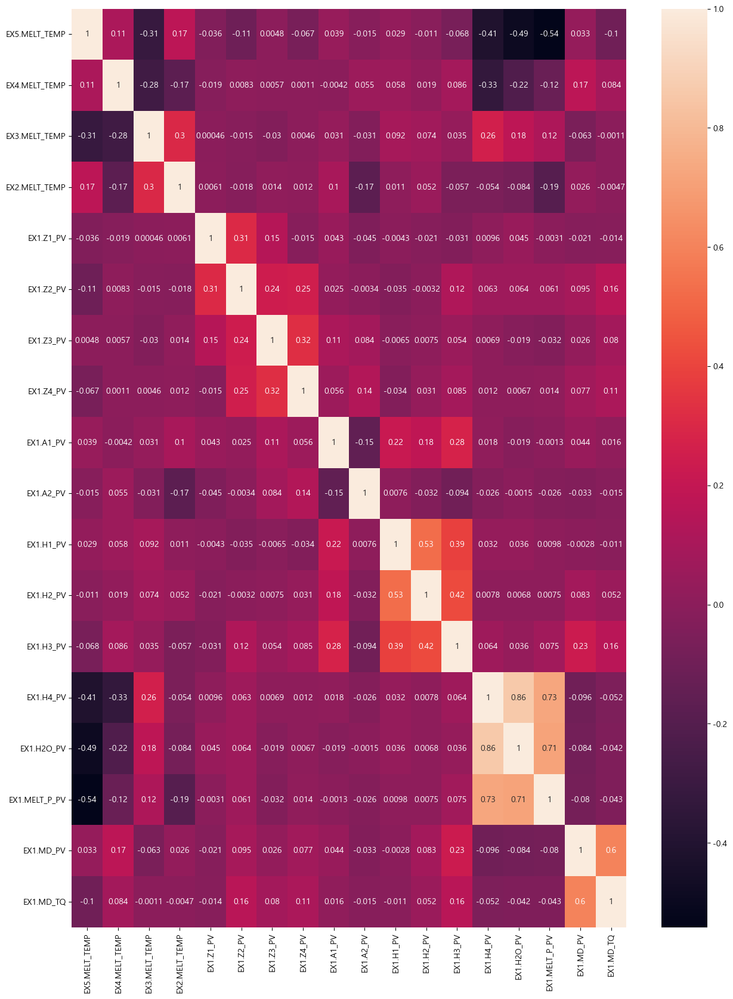
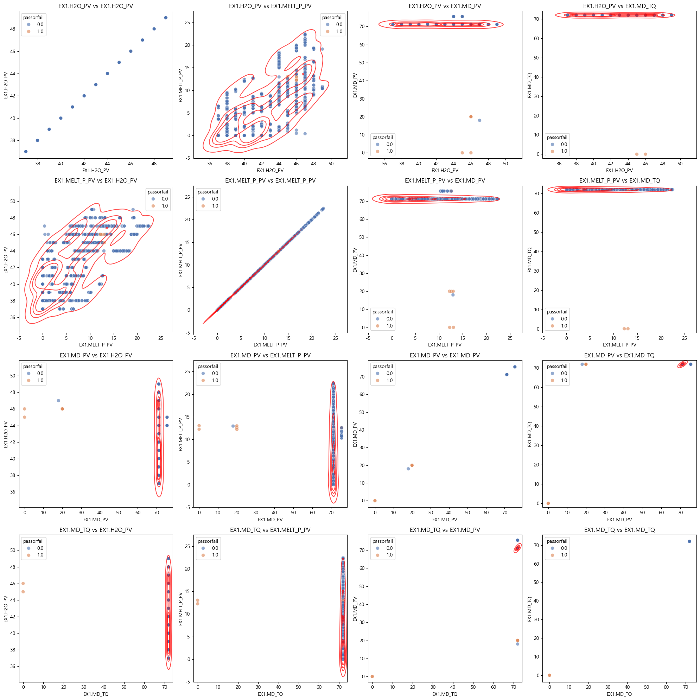
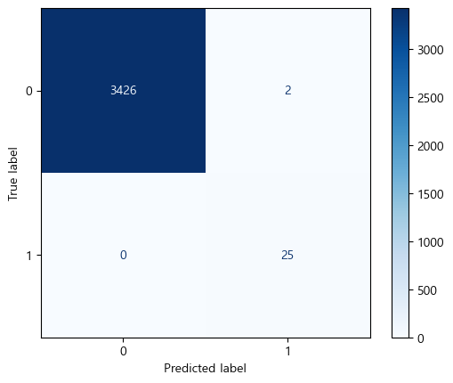
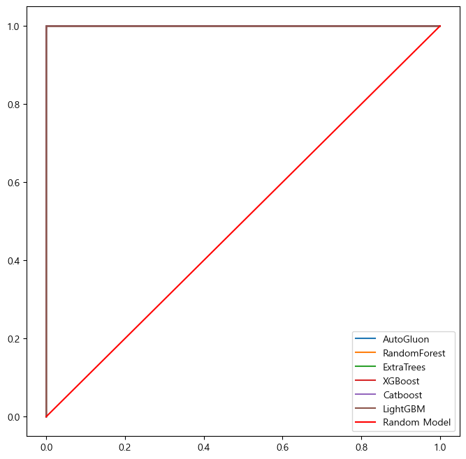

# NSGA_Multi_object_Optimal

데이터 출처: https://www.kamp-ai.kr/aidataDetail?AI_SEARCH=&page=4&DATASET_SEQ=49&EQUIP_SEL=&GUBUN_SEL=&FILE_TYPE_SEL=&WDATE_SEL=

### 문제 상황
소성가공 공정에서 발생하는 품질 불량 문제, 양품과 불량에 영향을 주는 변수들 간의 상관관계를 찾고 AI 모델을 활용하여 불량 판정과 품질에 주요하게 영향을 미치는 변수들을 확인한다.
여기서 나아가, 각 변수들을 변형 시뮬레이션하여 공정 난이도와 품질, 가격의 다중 목적을 최적화하는 프로젝트를 진행한다.

1. EDA

데이터 클렌징 이전 상관행렬, 우 하단 feature들에 상관성이 보임.

우 하단 feature들의 밀도 plot.
좌 상단 feature들은 시각화에 한하여, 상관관계가 있는 것으로 확인됨.
그러나 우 하단 feature들은 몇개의 이상치에 의한 높은 상관 관계이므로, 실제 상관 관계는 없다고 볼 수 있음.

이상치 제거 이후, EX1.MD-TQ는 단 하나의 값만을 가지며 상관성이 사라짐.(분산=0)

이에, 통제할 변수와 변형 가능한 변수들을 찾았음. (통제할 변수: [EX1.H4_PV, EX1.H2O_PV, EX1.MELT_P_PV])

2. 모델 훈련

저는 해당 공정에 자세히 모릅니다.
따라서 좋은 피쳐 엔지니어링이 불가능함.

이에, 강력한 Automl 모듈인 AutoGluon을 사용.

혼동행렬

다양한 모델에서 비슷한 성능을 낼 수 있는 것으로 보아, 데이터 자체는 상당히 깔끔하고 분류하기 쉬움.

<table border="1" class="dataframe">
  <thead>
    <tr style="text-align: right;">
      <th></th>
      <th>importance</th>
      <th>stddev</th>
      <th>p_value</th>
      <th>n</th>
      <th>p99_high</th>
      <th>p99_low</th>
    </tr>
  </thead>
  <tbody>
    <tr>
      <th>EX1.MD_PV</th>
      <td>0.463756</td>
      <td>0.026445</td>
      <td>0.000001</td>
      <td>5</td>
      <td>0.518207</td>
      <td>0.409306</td>
    </tr>
    <tr>
      <th>EX1.MELT_P_PV</th>
      <td>0.038641</td>
      <td>0.028176</td>
      <td>0.018708</td>
      <td>5</td>
      <td>0.096655</td>
      <td>-0.019373</td>
    </tr>
    <tr>
      <th>EX1.Z1_PV</th>
      <td>0.021422</td>
      <td>0.011535</td>
      <td>0.007116</td>
      <td>5</td>
      <td>0.045173</td>
      <td>-0.002330</td>
    </tr>
    <tr>
      <th>EX1.H2O_PV</th>
      <td>0.017881</td>
      <td>0.014669</td>
      <td>0.026337</td>
      <td>5</td>
      <td>0.048084</td>
      <td>-0.012322</td>
    </tr>
    <tr>
      <th>EX1.A1_PV</th>
      <td>0.007319</td>
      <td>0.008252</td>
      <td>0.059176</td>
      <td>5</td>
      <td>0.024309</td>
      <td>-0.009671</td>
    </tr>
    <tr>
      <th>EX1.A2_PV</th>
      <td>0.003299</td>
      <td>0.004521</td>
      <td>0.089050</td>
      <td>5</td>
      <td>0.012608</td>
      <td>-0.006010</td>
    </tr>
    <tr>
      <th>EX1.H1_PV</th>
      <td>0.002655</td>
      <td>0.011458</td>
      <td>0.315860</td>
      <td>5</td>
      <td>0.026246</td>
      <td>-0.020936</td>
    </tr>
    <tr>
      <th>EX1.H4_PV</th>
      <td>0.002333</td>
      <td>0.005217</td>
      <td>0.186950</td>
      <td>5</td>
      <td>0.013076</td>
      <td>-0.008409</td>
    </tr>
    <tr>
      <th>EX1.Z2_PV</th>
      <td>0.001814</td>
      <td>0.004056</td>
      <td>0.186950</td>
      <td>5</td>
      <td>0.010166</td>
      <td>-0.006538</td>
    </tr>
    <tr>
      <th>EX1.Z4_PV</th>
      <td>0.001502</td>
      <td>0.003358</td>
      <td>0.186950</td>
      <td>5</td>
      <td>0.008417</td>
      <td>-0.005413</td>
    </tr>
    <tr>
      <th>EX1.H3_PV</th>
      <td>0.000000</td>
      <td>0.000000</td>
      <td>0.500000</td>
      <td>5</td>
      <td>0.000000</td>
      <td>0.000000</td>
    </tr>
    <tr>
      <th>EX5.MELT_TEMP</th>
      <td>0.000000</td>
      <td>0.000000</td>
      <td>0.500000</td>
      <td>5</td>
      <td>0.000000</td>
      <td>0.000000</td>
    </tr>
    <tr>
      <th>EX1.H2_PV</th>
      <td>0.000000</td>
      <td>0.000000</td>
      <td>0.500000</td>
      <td>5</td>
      <td>0.000000</td>
      <td>0.000000</td>
    </tr>
    <tr>
      <th>EX4.MELT_TEMP</th>
      <td>0.000000</td>
      <td>0.000000</td>
      <td>0.500000</td>
      <td>5</td>
      <td>0.000000</td>
      <td>0.000000</td>
    </tr>
    <tr>
      <th>EX1.Z3_PV</th>
      <td>0.000000</td>
      <td>0.000000</td>
      <td>0.500000</td>
      <td>5</td>
      <td>0.000000</td>
      <td>0.000000</td>
    </tr>
    <tr>
      <th>EX2.MELT_TEMP</th>
      <td>0.000000</td>
      <td>0.000000</td>
      <td>0.500000</td>
      <td>5</td>
      <td>0.000000</td>
      <td>0.000000</td>
    </tr>
    <tr>
      <th>EX3.MELT_TEMP</th>
      <td>0.000000</td>
      <td>0.000000</td>
      <td>0.500000</td>
      <td>5</td>
      <td>0.000000</td>
      <td>0.000000</td>
    </tr>
    <tr>
      <th>EX1.MD_TQ</th>
      <td>0.000000</td>
      <td>0.000000</td>
      <td>0.500000</td>
      <td>5</td>
      <td>0.000000</td>
      <td>0.000000</td>
    </tr>
  </tbody>
</table>

이제, 시뮬레이션할 변수들을 찾았으므로, 시스템을 모델링하고 시뮬레이션을 진행합니다.