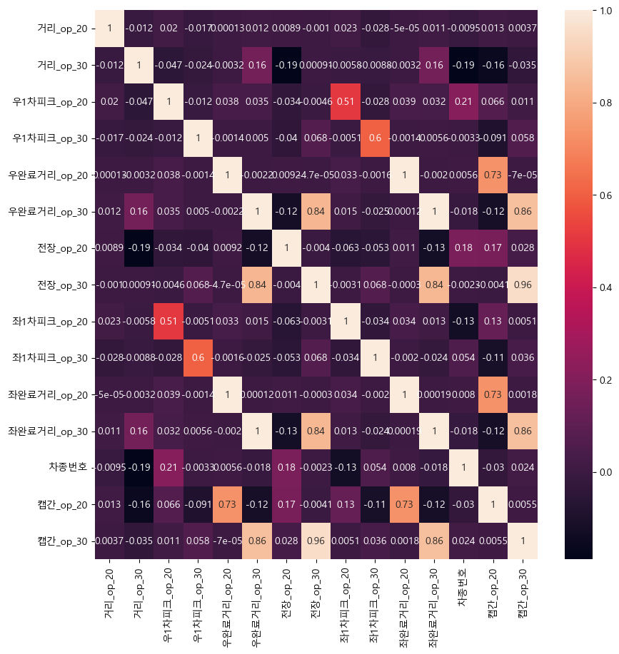
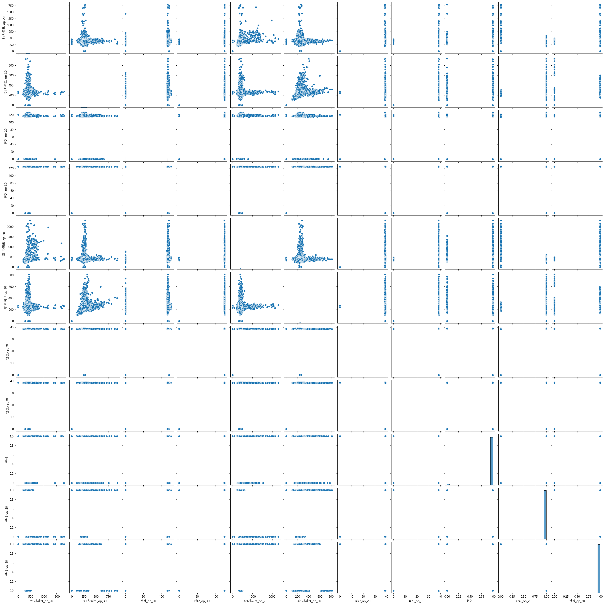
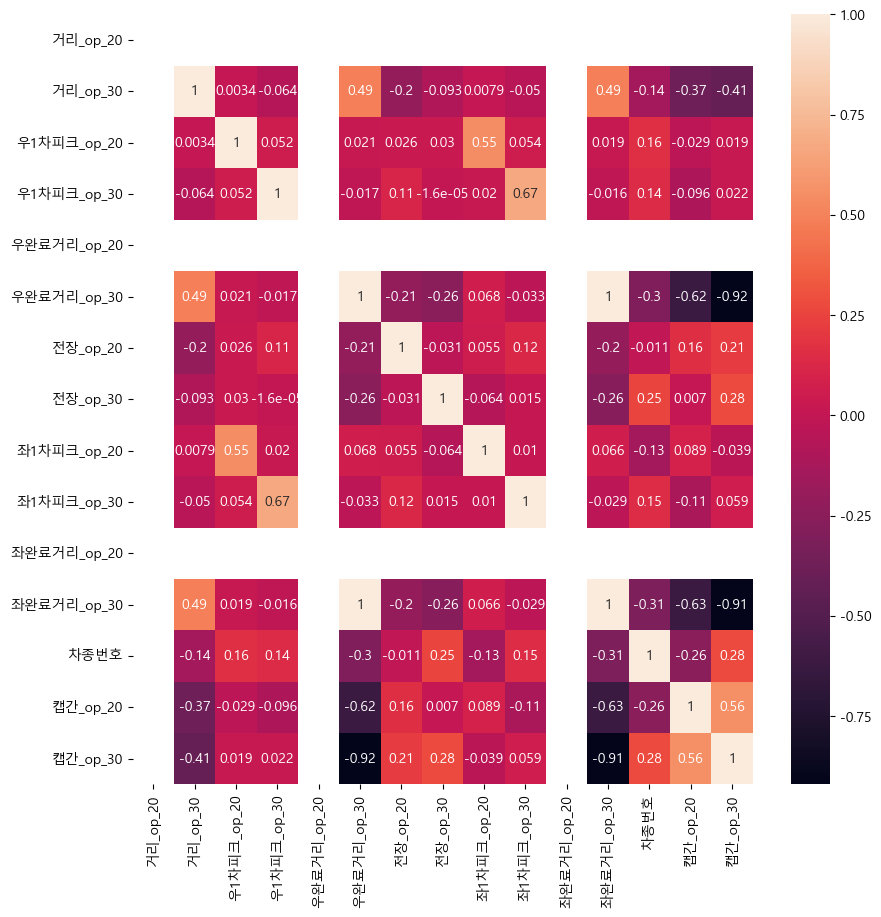
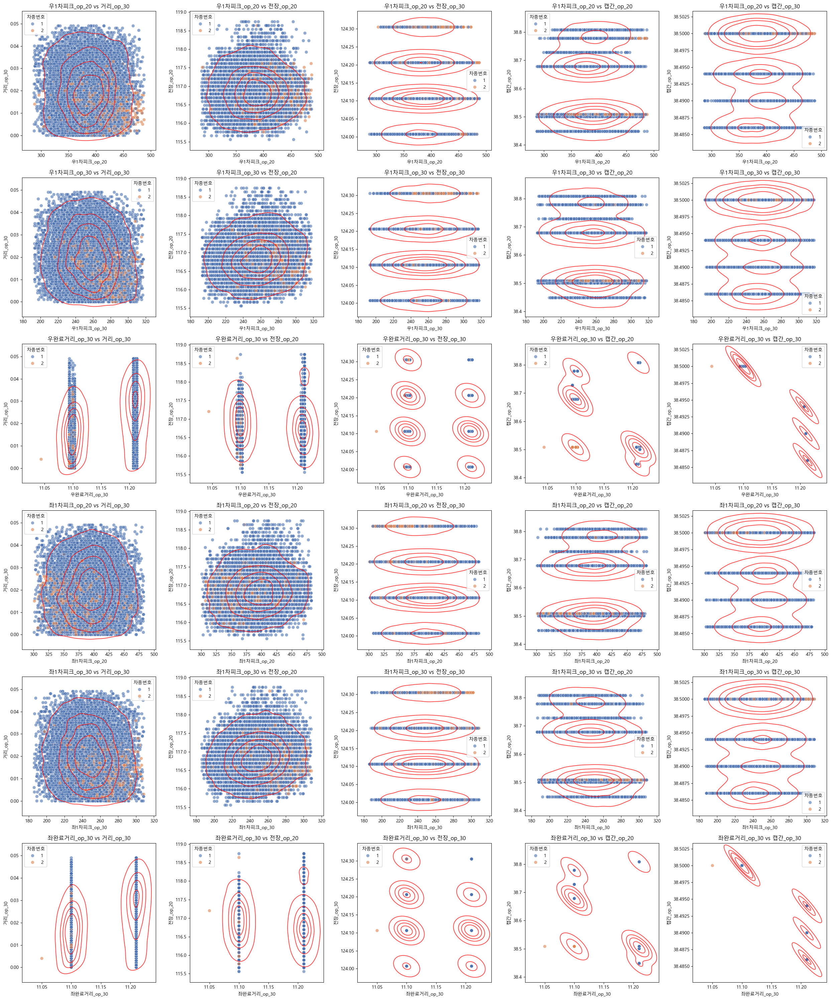

# NSGA_Multi_object_Optimal

데이터 비공개

1. EDA

  
데이터 클렌징 하기 전 상관행렬, 거리와 차종 번호를 제외한 열들의 상관관계가 확인됩니다.

  
시각화로 다시 확인한 결과, 극단적인 이상치로 인한 상관계수로 확인되었습니다.

  
&lt;이상치 제거 후 상관행렬&gt;  
1. 거리_op_20, 우완료거리_op_20, 좌완료거리_op_20은 모두 같은 값을 같게 되었습니다.  
&nbsp;&nbsp;&nbsp;&nbsp;머신러닝에 필요없는 변수가 되었으므로 제거할 수 있습니다.  
2. 1차피크, 완료거리_op_30은 여전히 강한 상관관계를 보이는 column들이 존재합니다.

  
밀도를 시각화한 결과, "우/좌완료거리_op_30"과 "캡간_op_30"에서의 상관관계를 제외하면, 통제가능한 변수로 확인됩니다.

이제, 시뮬레이션할 변수들을 찾았으므로, 시스템을 모델링하고 시뮬레이션을 진행합니다.

### 참고

Prediction and multi-objective optimization of mechanical, economical, and environmental properties for strain-hardening cementitious composites (SHCC) based on automated machine learning and metaheuristic algorithms. Yi Bao et al. Journal of Cleaner Production 329 (2021)